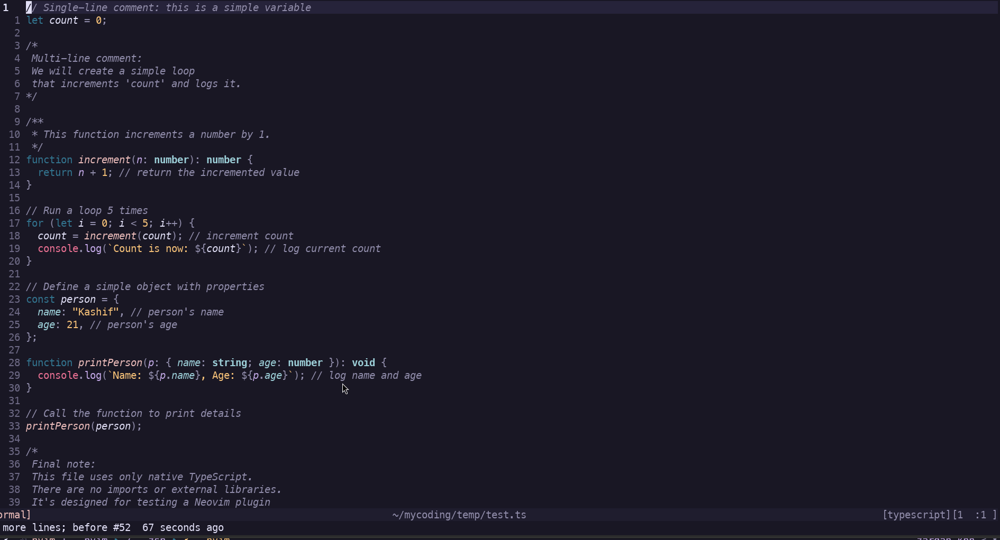

# nvim-remove-comments

Remove all comments from source code — as a Neovim plugin and as a standalone CLI tool.

Both tools use Tree-sitter for accurate, AST-based comment detection across many languages.



---

## Overview

| Tool | Use case |
|------|----------|
| [Neovim plugin](#neovim-plugin) | Remove comments from the current buffer |
| [CLI (`rmc` / `remove-comments`)](#cli-remove-comments--rmc) | Remove comments from an entire directory tree |

---

## Neovim Plugin

### Requirements

- Neovim >= 0.9
- [nvim-treesitter](https://github.com/nvim-treesitter/nvim-treesitter) with parsers installed for your languages

### Installation

**[lazy.nvim](https://github.com/folke/lazy.nvim)**

```lua
{
  "KashifKhn/nvim-remove-comments",
  config = function()
    require("nvim-remove-comments").setup()
  end,
}
```

### Usage

Default keybinding: `<leader>rc`

Or call directly:

```vim
:lua require("nvim-remove-comments").remove_comments()
```

### Supported Languages (Plugin)

JavaScript, TypeScript, TSX, Lua, Python, Go, Java, C, C++, Rust, HTML, CSS, YAML, TOML, Bash, Dart

---

## CLI: `remove-comments` / `rmc`

A standalone binary that walks a directory tree and removes all comments from every supported source file.

The installer creates both `remove-comments` and `rmc` — use whichever you prefer, they are the same binary.

**Default behavior is dry-run.** No files are modified unless `--write` is passed.

### Installation

**One-line installer (Linux / macOS)**

```sh
curl -fsSL https://raw.githubusercontent.com/KashifKhn/remove-comments/main/install.sh | sh
```

Install a specific version:

```sh
curl -fsSL https://raw.githubusercontent.com/KashifKhn/remove-comments/main/install.sh | sh -s -- --version 1.0.0
```

Skip modifying shell config:

```sh
curl -fsSL https://raw.githubusercontent.com/KashifKhn/remove-comments/main/install.sh | sh -s -- --no-modify-path
```

**Manual download**

Download a binary for your platform from the [releases page](https://github.com/KashifKhn/remove-comments/releases), extract, and place it on your `PATH`.

| Platform | Archive |
|----------|---------|
| Linux amd64 | `remove-comments-linux-amd64.tar.gz` |
| macOS amd64 | `remove-comments-darwin-amd64.tar.gz` |
| macOS arm64 | `remove-comments-darwin-arm64.tar.gz` |
| Windows amd64 | `remove-comments-windows-amd64.zip` |

**Build from source**

Requires Go >= 1.24.

```sh
git clone https://github.com/KashifKhn/remove-comments.git
cd remove-comments/cli
go build -o remove-comments .
ln -sf $(pwd)/remove-comments $(dirname $(pwd))/rmc
```

### Usage

Both `rmc` and `remove-comments` are identical — use either:

```sh
# Dry-run: show what would change (no files modified)
rmc .

# Apply changes
rmc --write .

# Target a specific directory
rmc --write ./src

# Process only Go files
rmc --lang go .

# Suppress per-file output, show only the summary
rmc --quiet .

# Show a unified diff per changed file
rmc --diff .

# Control parallelism
rmc --jobs 4 .
```

### Flags

| Flag | Short | Default | Description |
|------|-------|---------|-------------|
| `--write` | `-w` | `false` | Write changes to disk (default is dry-run) |
| `--diff` | `-d` | `false` | Print unified diff for each changed file |
| `--quiet` | `-q` | `false` | Print only the final summary line |
| `--lang` | | `""` | Process only files of this language (e.g. `go`, `python`) |
| `--jobs` | `-j` | NumCPU | Number of parallel workers |
| `--max-file-size` | | `10485760` | Skip files larger than this size in bytes (10 MB) |
| `--version` | | | Print version and exit |
| `--help` | `-h` | | Print help and exit |

### Supported Languages (CLI)

| Language | Extensions |
|----------|-----------|
| JavaScript | `.js` `.mjs` `.cjs` `.jsx` |
| TypeScript | `.ts` `.tsx` |
| Go | `.go` |
| Python | `.py` |
| Rust | `.rs` |
| Java | `.java` |
| C | `.c` `.h` |
| C++ | `.cpp` `.cc` `.cxx` `.hpp` |
| Lua | `.lua` |
| HTML | `.html` `.htm` |
| CSS | `.css` |
| YAML | `.yaml` `.yml` |
| TOML | `.toml` |
| Bash | `.sh` `.bash` |
| Dart | `.dart` |

Files with unsupported extensions are skipped. The walker also respects `.gitignore` rules.

---

## Why?

LLM-generated code tends to be full of explanatory comments. This toolset strips them out quickly so you can read and maintain the code without noise.

---

## Repository Structure

```
nvim-remove-comments/
├── lua/nvim-remove-comments/   # Neovim plugin (Lua)
├── plugin/                     # Neovim autoload entry point
├── install.sh                  # CLI one-line installer
└── cli/                        # Go CLI tool
    ├── main.go
    ├── cmd/
    └── internal/
        ├── languages/          # Language → Tree-sitter grammar + query map
        ├── walker/             # Directory walker with .gitignore support
        ├── parser/             # Tree-sitter comment range extraction
        ├── remover/            # Comment removal from source bytes
        ├── diff/               # Before/after diff computation
        └── output/             # Terminal output and summary
```
